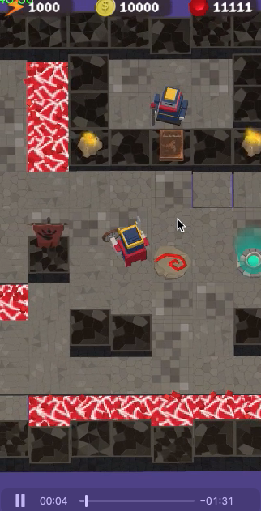

过去的一段时间进行了一个地牢迷宫探索游戏，目前已经暂停(烂尾)无法继续开发，所以做个总结，并且将其开源，工程质量不高，仅供娱乐参考。

# 项目背景

主要参考了以下几个游戏:

+ 贪婪洞窟：偏策略型，遇到怪物可以选择打与不打。
+ 夜勤人：偏战斗型，比较考玩家操作。
+ QuestKeeper：一个地牢移动游戏，玩家只需要上下左右移动，躲避机关和陷阱。
+ 金坷垃旅馆：偏策略性，比较难。

于是乎，我觉得做一个迷宫探索游戏，混合陷阱机关和怪物，偏操作的手机游戏是个比较不错的选择，并且市面上还没有。

# 游戏设计

+ 主循环：玩家探索地牢，搜集金币，通过金币解锁不同的装备和道具，再次探索地闹。
+ 特色： 陷阱和机关，地牢中有地刺，弓箭，等各种机关，玩家需要灵活的躲避。
+ 怪物：地牢中生存各种怪物，比如史莱姆，玩家需要战胜怪物，并且怪物也可以通过玩家的智慧被机关干掉。
+ 武器：初始没有武器，全靠走位可以通过部分迷宫，马上送一把剑盾，剑盾可以攻击和防御，反弹弓箭等，计划开发大剑，弓箭，枪等武器，分别有不同的攻击范围和长度，玩家可以挑选自己顺手的武器来通关。

# 动图参考

# 有意义的代码

+ 迷宫生成
+ Astar寻路

# 烂尾原因

+ 丑。
+ 不好玩。

也许哪天会重新开始开发。

